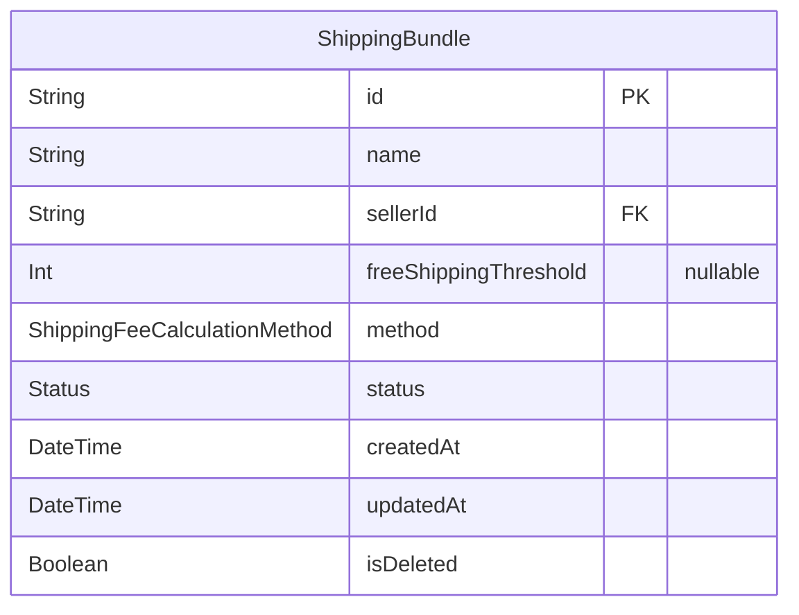
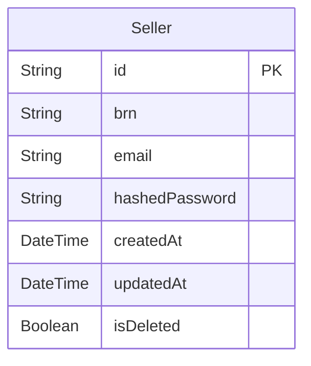
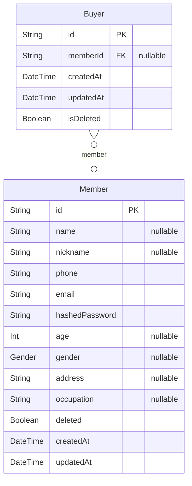
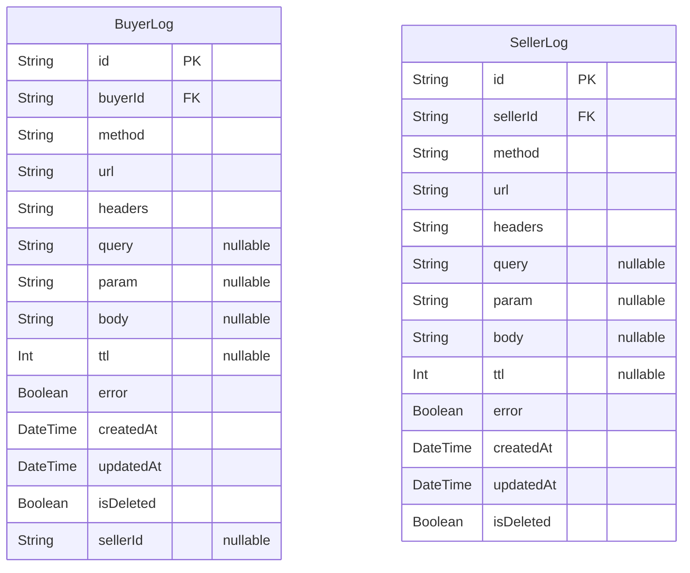

# Commerce
> Generated by [`prisma-markdown`](https://github.com/samchon/prisma-markdown)

- [Product](#product)
- [Seller](#seller)
- [Buyer](#buyer)
- [log](#log)

## Product

### `ShippingBundle`

**Properties**
  - `id`: 
  - `name`: name of this shipping bundle.
  - `sellerId`: 
  - `freeShippingThreshold`: If method column's value is `FreeOverThreshold`, This value is not null.
  - `method`: `MIN` OR `MAX` OR `FREE_OVER_THRESHOLD`. Shipping cost calculation method
  - `status`: `ACTIVE` OR `INACTIVE`. If this value is inactive, bundle shipping criteria will not be applied.
  - `createdAt`: DateTime this row was created.
  - `updatedAt`: DateTime this row was updated.
  - `isDeleted`: If this row was deleted, It will be true. And `updatedAt` column will mean `deletedAt`.

## Seller

### `Seller`

**Properties**
  - `id`: 
  - `brn`: businessRegistrationNumber
  - `email`: The email address of the seller.
  - `hashedPassword`: The encrypted value of the seller's password.
  - `createdAt`: DateTime this row was created.
  - `updatedAt`: DateTime this row was updated.
  - `isDeleted`: If this row was deleted, It will be true. And `updatedAt` column will mean `deletedAt`.

## Buyer

### `Buyer`
Generate a unique identifier for each request from the browser to uniquely identify buyers who are not logged in.

**Properties**
  - `id`: Assigns the same ID for the same session, generated by the client.
  - `memberId`: Records the memberId if the session is identified.
  - `createdAt`: DateTime this row was created.
  - `updatedAt`: DateTime this row was updated.
  - `isDeleted`: If this row was deleted, It will be true. And `updatedAt` column will mean `deletedAt`.

### `Member`
Represents a buyer who has signed up.

**Properties**
  - `id`: 
  - `name`: The actual name of the member.
  - `nickname`: The nickname of the member.
  - `phone`: The phone number of the member.
  - `email`: The email address of the member.
  - `hashedPassword`: The encrypted value of the member's password.
  - `age`: The age of the member.
  - `gender`: The gender of the member (MALE | FEMALE). If this value is null, It means `unknown`.
  - `address`: The address of the member.
  - `occupation`: The occupation of the member.
  - `deleted`: Indicates whether the information is deleted; deletion time is determined by updatedAt.
  - `createdAt`: The date when the member information was created.
  - `updatedAt`: The most recent update date of the information.

## log

### `BuyerLog`
Records logs for all requests.

**Properties**
  - `id`: The unique ID of the log, attached to the Request object.
  - `buyerId`: Indicates which buyer made the request.
  - `method`: 'GET' | 'POST' | 'PUT' | 'PATCH' | 'DELETE'.
  - `url`: Stores the original URL.
  - `headers`: Stores the buyer's HTTP headers.
  - `query`: Stores the buyer's HTTP query parameters as objects.
  - `param`: Stores the buyer's HTTP parameters as objects.
  - `body`: Stores the buyer's HTTP body as objects.
  - `ttl`: Measured in ms, the time taken for the request from request to response.
  - `error`: Updates the Request object ID in case of an error.
  - `createdAt`: DateTime this row was created.
  - `updatedAt`: DateTime this row was updated.
  - `isDeleted`: If this row was deleted, It will be true. And `updatedAt` column will mean `deletedAt`.
  - `sellerId`: 

### `SellerLog`
Records logs for all requests.

**Properties**
  - `id`: The unique ID of the log, attached to the Request object.
  - `sellerId`: Indicates which seller made the request.
  - `method`: 'GET' | 'POST' | 'PUT' | 'PATCH' | 'DELETE'.
  - `url`: Stores the original URL.
  - `headers`: Stores the seller's HTTP headers.
  - `query`: Stores the seller's HTTP query parameters as objects.
  - `param`: Stores the seller's HTTP parameters as objects.
  - `body`: Stores the seller's HTTP body as objects.
  - `ttl`: Measured in ms, the time taken for the request from request to response.
  - `error`: Updates the Request object ID in case of an error.
  - `createdAt`: DateTime this row was created.
  - `updatedAt`: DateTime this row was updated.
  - `isDeleted`: If this row was deleted, It will be true. And `updatedAt` column will mean `deletedAt`.