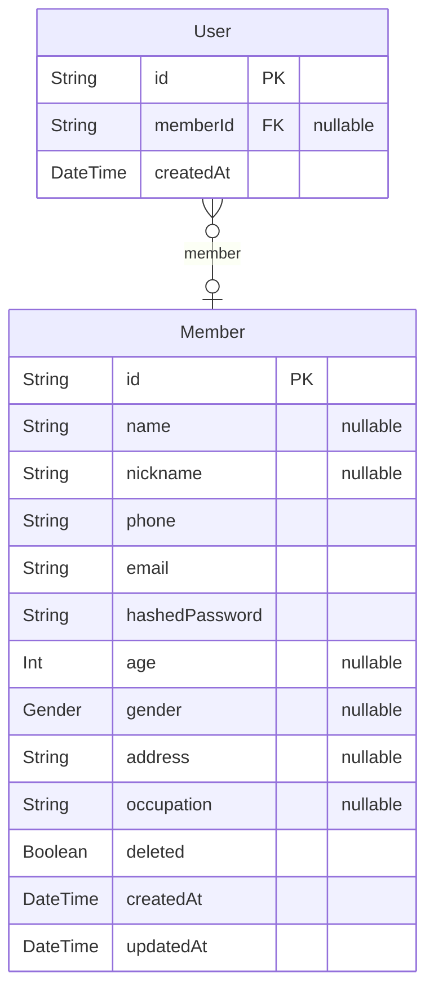
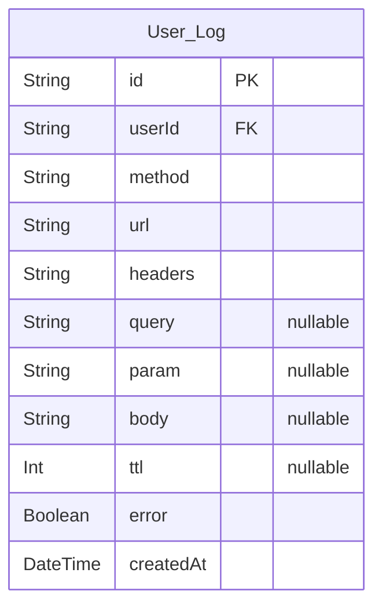

# Commerce
> Generated by [`prisma-markdown`](https://github.com/samchon/prisma-markdown)

- [Buyer](#buyer)
- [log](#log)

## Buyer

### `User`
Generate a unique identifier for each request from the browser to uniquely identify users who are not logged in.

**Properties**
  - `id`: Assigns the same ID for the same session, generated by the client.
  - `memberId`: Records the memberId if the session is identified.
  - `createdAt`: 

### `Member`
Represents a user who has signed up.

**Properties**
  - `id`: 
  - `name`: The actual name of the member.
  - `nickname`: The nickname of the member.
  - `phone`: The phone number of the member.
  - `email`: The email address of the member.
  - `hashedPassword`: The encrypted value of the member's password.
  - `age`: The age of the member.
  - `gender`: The gender of the member (MALE | FEMALE). If this value is null, It means `unknown`.
  - `address`: The address of the member.
  - `occupation`: The occupation of the member.
  - `deleted`: Indicates whether the information is deleted; deletion time is determined by updatedAt.
  - `createdAt`: The date when the member information was created.
  - `updatedAt`: The most recent update date of the information.

## log

### `User_Log`
Records logs for all requests.

**Properties**
  - `id`: The unique ID of the log, attached to the Request object.
  - `userId`: Indicates which user made the request.
  - `method`: 'GET' | 'POST' | 'PUT' | 'PATCH' | 'DELETE'.
  - `url`: Stores the original URL.
  - `headers`: Stores the user's HTTP headers.
  - `query`: Stores the user's HTTP query parameters as objects.
  - `param`: Stores the user's HTTP parameters as objects.
  - `body`: Stores the user's HTTP body as objects.
  - `ttl`: Measured in ms, the time taken for the request from request to response.
  - `error`: Updates the Request object ID in case of an error.
  - `createdAt`: 